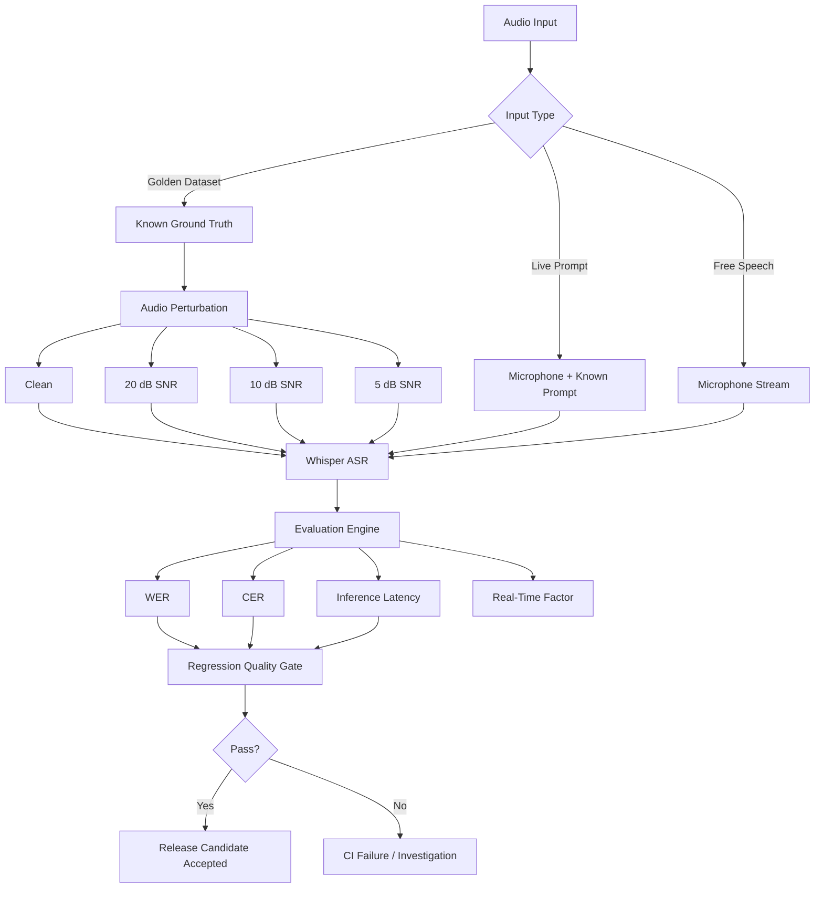

# Voice Agent QA

A Python-based QA and evaluation framework for testing speech and voice-AI systems across deterministic datasets, controlled audio degradation, automated regression gates, and live microphone scenarios.

The project treats the speech model as the **system under test**. Its focus is not building an ASR model from scratch, but designing the tooling and methodology needed to answer questions such as:

* Did speech-recognition quality regress?
* How does the system behave under noisy audio?
* Can a release be automatically blocked when quality falls outside an accepted baseline?
* Can the pipeline process audio fast enough for real-time applications?
* How does the system behave with actual microphone input rather than only offline datasets?

## Architecture



## What the framework currently tests

### Deterministic ASR regression

A labeled LibriSpeech subset provides repeatable speech samples with known reference transcripts.

Each sample is passed through the ASR pipeline and evaluated using:

* Word Error Rate (WER)
* Character Error Rate (CER)
* inference latency

The dataset provides the ground truth, eliminating the need to manually transcribe test recordings.

### Controlled noise robustness

The framework programmatically generates degraded versions of clean speech using **additive white Gaussian noise (AWGN)**.

For each recording, the actual mean-square signal power is measured. Gaussian noise is generated with NumPy and scaled to reach a specified signal-to-noise ratio:

$$
P_{noise} =
\frac{P_{signal}}
{10^{SNR_{dB}/10}}
$$

This produces deterministic 20 dB, 10 dB, and 5 dB SNR test conditions.

A fixed random seed makes generated audio reproducible across regression runs.

### Current benchmark

| Scenario  | Samples | Average WER | Average CER | Avg. Inference |
| --------- | ------: | ----------: | ----------: | -------------: |
| Clean     |      15 |       2.09% |       0.48% |         1.48 s |
| 20 dB SNR |      15 |       2.69% |       0.97% |         1.50 s |
| 10 dB SNR |      15 |       5.92% |       3.06% |         1.47 s |
| 5 dB SNR  |      15 |      11.56% |       7.73% |         1.64 s |

The experiment shows a clear degradation in transcription accuracy as SNR decreases, while inference time remains comparatively stable.

This distinction is important for production monitoring: a speech system can remain responsive while its recognition quality deteriorates.

## Automated quality gates

Benchmark results are compared with established reference measurements.

Instead of defining one arbitrary universal WER threshold, the framework detects **regression relative to an accepted baseline**.

For example:

```text
Reference WER:       2.09%
Allowed regression: +2.00 percentage points
Maximum accepted:    4.09%
```

If the measured result exceeds the configured quality budget, the quality gate exits with a non-zero status and can block a CI pipeline.

Latency is measured but is not enforced across heterogeneous CI hardware because execution time is hardware-dependent.

## Live microphone testing

Offline datasets provide repeatability, but they cannot fully represent real-world microphone behavior.

The project therefore includes two live validation modes.

### Prompted live accuracy test

```powershell
python -m scripts.live_prompt_test
```

The framework:

1. Selects a known reference sentence.
2. Displays it to the tester.
3. Records microphone input until speech ends.
4. Uses silence detection to automatically stop recording.
5. Applies voice activity detection before transcription.
6. Transcribes the captured audio.
7. Calculates WER, CER, inference latency, and Real-Time Factor.

This provides objective accuracy measurements using actual microphone input without manually creating reference transcripts.

### Free live transcription

```powershell
python -m scripts.live_transcribe
```

The framework continuously captures microphone audio in chunks and evaluates:

* recognized speech
* inference latency
* Real-Time Factor
* silence handling
* speech-detection behavior

This mode is intended for exploratory testing rather than WER measurement because arbitrary speech has no predefined ground-truth transcript.

## Real-Time Factor

Real-Time Factor measures processing speed relative to the duration of the audio:

$$
RTF =
\frac{inference\ time}
{audio\ duration}
$$

An RTF below 1 means the system processes audio faster than real time.

During local microphone experiments, four-second speech chunks were processed in roughly 0.6–0.7 seconds, corresponding to an RTF around 0.16–0.17.

RTF measures model processing throughput. It should not be confused with perceived conversation latency, which also includes audio collection, end-of-turn detection, downstream reasoning, TTS generation, transport, and playback.

## Test methodology

The framework deliberately separates three forms of validation:

**Golden-dataset regression** answers:

> Did model or pipeline quality regress under repeatable conditions?

**Prompted live testing** answers:

> How accurately does the system handle an actual human speaking through a microphone?

**Free-speech exploratory testing** answers:

> How does the system behave during realistic, unscripted interaction?

Using all three provides more useful coverage than relying exclusively on either an offline benchmark or ad-hoc manual testing.

## Technology

* Python
* pytest
* faster-whisper
* NumPy
* SoundFile
* sounddevice
* jiwer
* Silero VAD through faster-whisper
* GitHub Actions

## Project structure

```text
voice-agent-qa/
│
├── config/
│   └── quality_gates.json
│
├── datasets/
│   ├── clean/
│   ├── generated/
│   └── metadata/
│
├── reports/
│
├── scripts/
│   ├── download_golden_dataset.py
│   ├── generate_noise_dataset.py
│   ├── run_baseline.py
│   ├── run_noise_benchmark.py
│   ├── check_quality_gate.py
│   ├── live_prompt_test.py
│   └── live_transcribe.py
│
├── src/
│   ├── asr/
│   │   └── whisper_engine.py
│   ├── audio/
│   │   ├── microphone.py
│   │   └── perturbations.py
│   └── evaluation/
│       ├── metrics.py
│       ├── performance.py
│       └── quality_gate.py
│
├── tests/
├── pytest.ini
└── requirements.txt
```

## Running locally

Create and activate a virtual environment:

```powershell
python -m venv .venv
.\.venv\Scripts\Activate.ps1
```

Install dependencies:

```powershell
pip install -r requirements.txt
```

Run unit tests:

```powershell
pytest -m "not evaluation" -v
```

Download the golden dataset:

```powershell
python -m scripts.download_golden_dataset
```

Generate noise scenarios:

```powershell
python -m scripts.generate_noise_dataset
```

Establish the clean baseline:

```powershell
python -m scripts.run_baseline
```

Run the SNR benchmark:

```powershell
python -m scripts.run_noise_benchmark
```

Run evaluation assertions:

```powershell
pytest -m evaluation -v
```

Apply the release quality gate:

```powershell
python -m scripts.check_quality_gate
```

Run live prompted validation:

```powershell
python -m scripts.live_prompt_test
```

Run exploratory microphone transcription:

```powershell
python -m scripts.live_transcribe
```

## CI strategy

The GitHub Actions workflow separates inexpensive framework/unit tests from more expensive speech-evaluation jobs.

The evaluation pipeline:

```text
Download golden corpus
        ↓
Generate deterministic noisy audio
        ↓
Run clean ASR baseline
        ↓
Run noise robustness benchmark
        ↓
Calculate WER / CER / latency
        ↓
Run evaluation assertions
        ↓
Apply regression quality gates
        ↓
Upload benchmark artifacts
```

Generated audio does not need to be committed because CI can reproduce it deterministically.

## Current limitations

This project currently evaluates the ASR portion of a voice pipeline and microphone behavior. It is not yet a complete conversational voice-agent evaluator.

Future extensions include:

* TTS quality and time-to-first-audio measurement
* conversational state and intent validation
* barge-in and interruption testing
* speaker/accent diversity cohorts
* semantic response evaluation
* SIP/PSTN call testing
* WebRTC testing
* packet-loss, jitter, and network-condition simulation
* concurrent-call/load testing
* API contract and compatibility testing
* production telemetry and failure-rate analysis

## Related project

The evaluation architecture is intentionally independent of any one application.

A future integration target is **VoiceGuard Speech Monitor**, a real-time Python speech application with microphone capture, phrase detection, a Tkinter interface, automated testing, and CI.

Keeping the evaluator separate allows multiple ASR engines or voice applications to be benchmarked against the same datasets and quality criteria.
